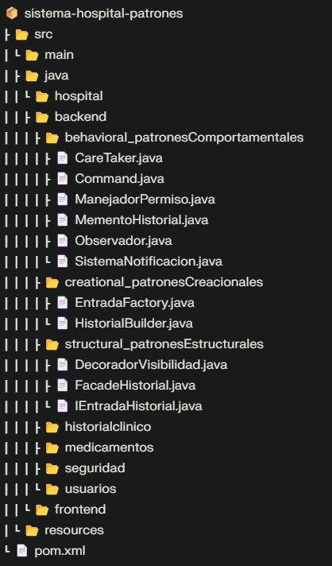

# 🏥 Sistema de Gestión de Historiales Médicos - SGCI

Sistema integral para la gestión de historiales clínicos en la **Clínica Salud y Vida Bogotá**, desarrollado como parte del módulo **Grupo 6: Gestión de Historiales Médicos** del Sistema de Gestión Clínica Integral (SGCI) [2][3].

## 📋 Descripción del Proyecto

Este sistema permite la **creación, consulta y actualización de diagnósticos, tratamientos y notas médicas** por cada paciente, implementando patrones de diseño que garantizan escalabilidad, mantenibilidad y seguridad en el manejo de información clínica sensible [2][3].

### Problema que Resuelve

La Clínica Salud y Vida Bogotá enfrentaba historias clínicas fragmentadas, con información dispersa en formatos físicos o sistemas no integrados. Esto dificultaba el acceso rápido y completo al historial durante consultas o emergencias [2].

## 🎯 Funcionalidades Principales

- **RF01**: Visualización completa del historial clínico en timeline visual con filtros por fecha, tipo de evento y médico tratante [3]
- **RF06**: Gestión de accesos basada en roles y permisos configurables (lectura, edición, exportación) [3]
- **RF08**: Notas médicas traducidas a lenguaje comprensible para pacientes [3]
- **RF10**: Visualización del diagnóstico más actualizado con historial de cambios [3]

## 🏗️ Arquitectura y Patrones de Diseño

El proyecto implementa **8 patrones de diseño** distribuidos en tres categorías [1]:

### Patrones Creacionales
- **Factory Method** (`EntradaFactory.java`): Creación de objetos como Diagnóstico, Nota Médica o Tratamiento
- **Builder** (`HistorialBuilder.java`): Construcción paso a paso de historiales clínicos complejos

### Patrones Estructurales
- **Facade** (`FacadeHistorial.java`): Interfaz simplificada para consulta de historiales
- **Decorator** (`DecoradorVisibilidad.java`): Extensión de funcionalidades (ej. visibilidad para pacientes)

### Patrones Comportamentales
- **Observer** (`Observador.java`, `SistemaNotificacion.java`): Notificaciones en tiempo real de cambios en historiales
- **Command** (`Command.java`): Registro de acciones para auditoría
- **Memento** (`MementoHistorial.java`, `CareTaker.java`): Versionado y recuperación de estados anteriores
- **Chain of Responsibility** (`ManejadorPermiso.java`): Validación de accesos y permisos por niveles

## 🛠️ Tecnologías Utilizadas

- **Lenguaje**: Java 17
- **Gestión de Dependencias**: Maven 4.0.0
- **Base de Datos**: MySQL 8.0.33 con MySQL Connector/J
- **Interfaz Gráfica**: FlatLaf 3.0 (Look and Feel moderno)
- **Arquitectura**: MVC con separación backend/frontend

## 📁 Estructura del Proyecto

## 🚀 Instalación y Configuración

### Prerrequisitos
- Java JDK 17 o superior
- Maven 3.6+
- MySQL 8.0+
- IDE (IntelliJ IDEA, Eclipse o NetBeans)

### Pasos de Instalación

1. **Descargar o clonar el repositorio**

2. **Configurar la base de datos**

3. **Configurar conexión a base de datos**
   Editar credenciales en el archivo de configuración de conexión MySQL.

4. **Compilar el proyecto**

5. **Ejecutar la aplicación**

## 👥 Equipo de Desarrollo

- **John Mesa**
- **Juan José Restrepo Londoño**

**Responsabilidad**: Gestión de Historiales Médicos - Creación, consulta y actualización de diagnósticos, tratamientos y notas por cada paciente.

## 🔐 Seguridad y Cumplimiento

- Implementación de roles y permisos basados en necesidad del puesto
- Cifrado de datos sensibles
- Cumplimiento con **Ley 1581 de Protección de Datos Personales en Colombia** 
- Sistema de auditoría mediante patrón Command 

## 📊 Casos de Uso

### HU01: Historias clínicas completas
**Como** médico, **quiero** ver el historial clínico completo de un paciente en un timeline visual **para** comprender su evolución y tomar mejores decisiones médicas [4].

### HU08: Notas médicas para pacientes
**Como** paciente, **quiero** ver mis notas médicas en lenguaje sencillo y comprensible **para** entender mi diagnóstico, tratamiento y evolución [4].

### HU10: Diagnóstico más actualizado
**Como** paciente, **quiero** ver mi diagnóstico más reciente con explicación comprensible **para** conocer mi estado actual y opciones de tratamiento [4].

---

**Repositorio**: [https://github.com/johnmesa-cell/sistema-hospital-patrones](https://github.com/johnmesa-cell/sistema-hospital-patrones)

